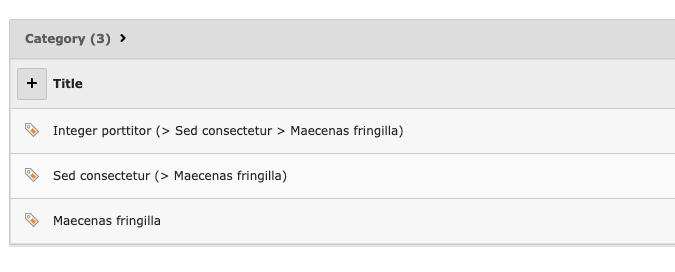

# Backend category hierarchy view

## About

This extension adds a small method to process the category title and add the whole hierarchy to the list view.

It does not change anything in the record edit or tree views.

### _News_ extension

The _news_ extension adds its own processor for category titles, but does nothing useful imho, 
so we don't call it afterwards.
The `route` checked there (`\GeorgRinger\News\Hooks\Labels`) is never matching.
