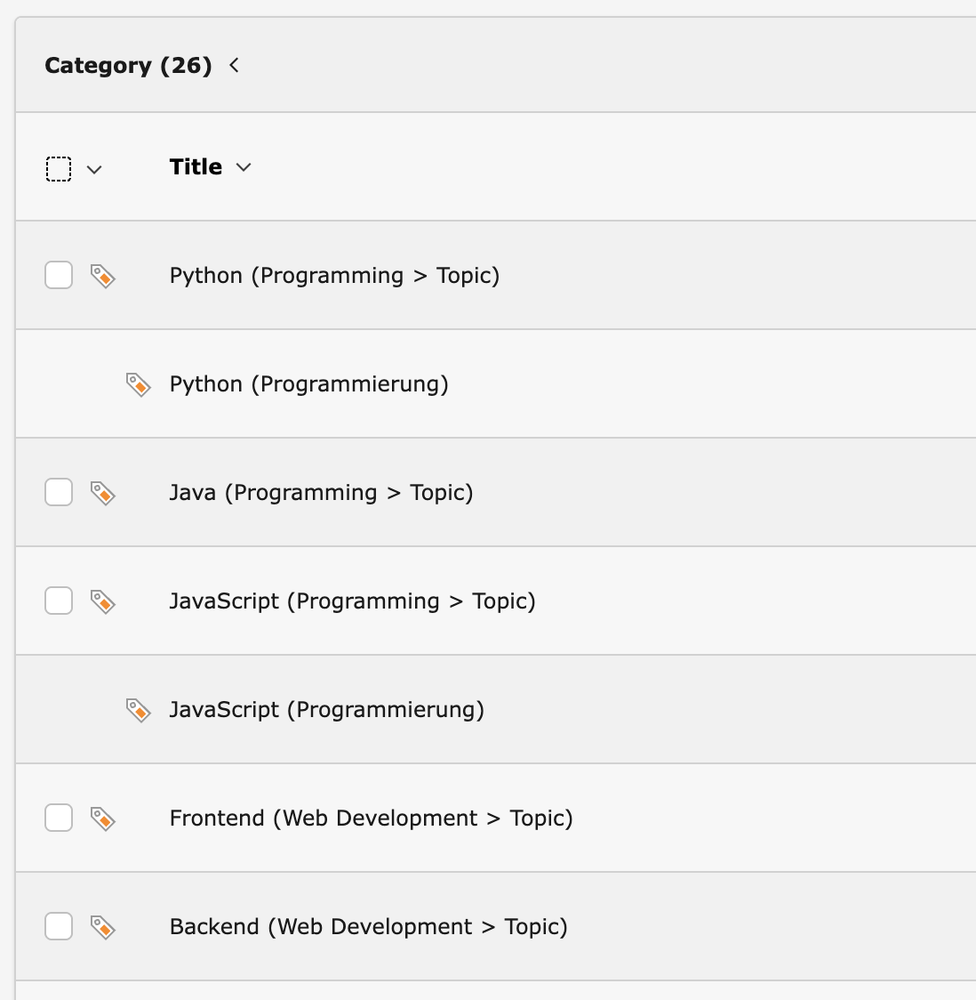
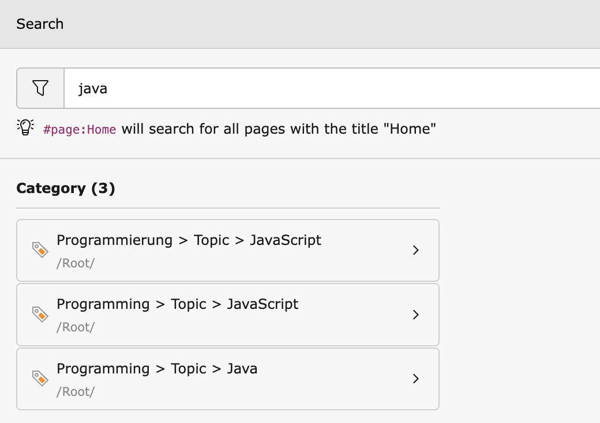

# Backend Category Hierarchy

[](https://packagist.org/packages/plan2net/backend-category-hierarchy)
[](https://packagist.org/packages/plan2net/backend-category-hierarchy)
[](https://get.typo3.org/)
[](https://www.php.net/)
[](LICENSE)

Show the full parent path of every `sys_category` record in TYPO3 backend lists.



The hierarchy is also shown in the global backend search:



## Why

TYPO3's backend lists only show the leaf title of a category. Once an editor
has multiple branches with categories named _News_, _Frontend_, or _Events_,
those rows become indistinguishable.

This extension augments the displayed title with its full ancestor chain in
list views and reference dropdowns. Edit forms and tree views are left
untouched.

## Installation

```bash
composer require plan2net/backend-category-hierarchy
```

## Configuration

By default, a category record like _Java_ under _Programming_ under _Topic_
renders as:

```
Java (Programming > Topic)
```

To change the format per Site, add a `backendCategoryHierarchy` block to
`config/sites/<identifier>/config.yaml`:

```yaml
backendCategoryHierarchy:
  titleTemplate: '{ancestors} > {current}'
  ancestorSeparator: ' > '
```

With the snippet above, the same category renders as:

```
Programming > Topic > Java
```

Placeholders in `titleTemplate`:

- `{current}` — the category title
- `{ancestors}` — the ancestor chain joined by `ancestorSeparator`

Invalid values (empty, or a template missing one of the placeholders) silently
fall back to the defaults `{current} ({ancestors})` and ` > `.

## Development

```bash
composer test:unit   # phpunit
composer quality     # php-cs-fixer + phpstan + psalm + phpunit
```
